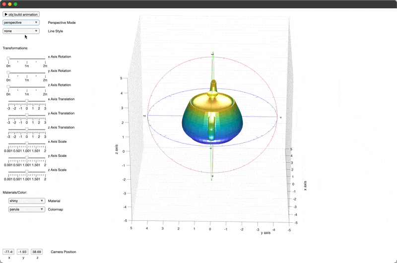
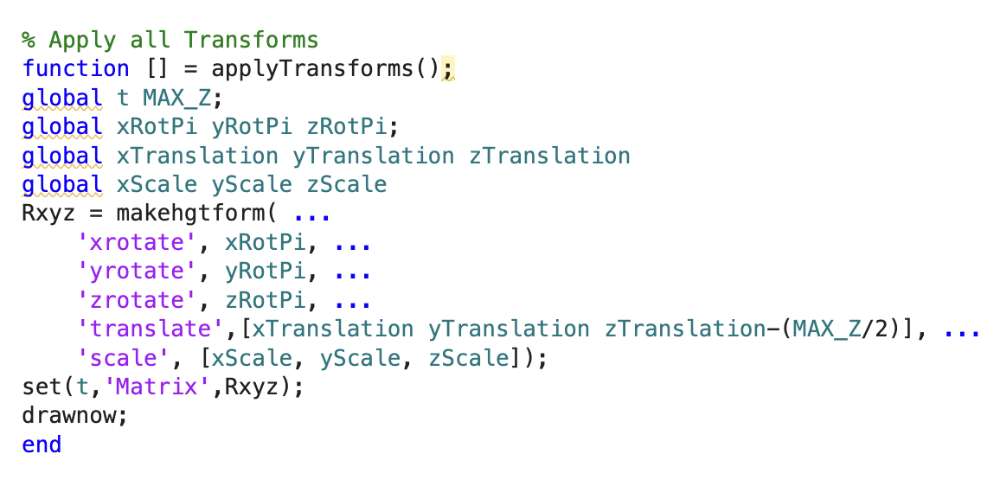
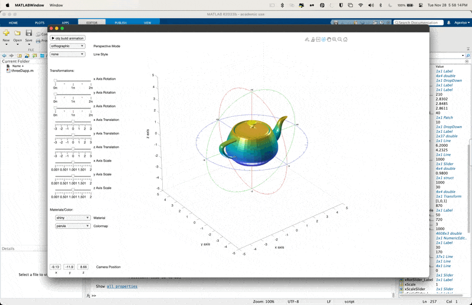

# MatlabGraphicsPlayground

## How to Run?
One of this project's requirements is to be able to run the file from the browser. While MATLAB's web compiler would be a great option to create a web app, it requires the developer to create the app using the drag-and-drop Web Designer, which does not allow me to create the application programatically, and host the application. For a project of this scope I am opting for the user to run the script in MATLAB online. 

To run the application online, you may open the local file [src/threeDapp.m](src/threeDapp.m) in MATLAB Online. For ease of use I have also placed this script in MATLAB drive, accessible using this [share link](https://drive.matlab.com/sharing/4a1085e5-0515-4f2d-9677-01e2021c8df2).

## UI Features

### Build animation
Animation that shows the incremental building of the 3D model, highlighting the role of vertexes and faces in rendering.

### Perspective/Orthographic Rendering + Wireframe
Change between perspective projection (to show depth) or orthographic projection (to maintain parallel lines). Also shows face outlines,

### Obj/Axes Reference Guide
Credit to Rodney Rodríguez's excellent [Medium Article](https://medium.com/geekculture/3d-animations-made-simple-with-matlab-visualizing-flight-test-data-and-simulation-results-ed399cdcc711). 

Shows a spherical reference guide at the center of the Utah Teapot object. Visualizes the axes, and provides a lot of visual context to the Interactive Transformations.

### Transformations
Interactive tools to visualize the rotation, translation and scaling transforms, for each axis. Works by generating a transformation matrix as a product of previous transformations, and applying that to the parent object `t`.

### Materials/Colormaps
Demonstrates how material properties can effect model light interactions. Can also set to one of many colormap presets.

### Camera Position 
Shows camera coordinates, updated while rotating, can set specific camera position to create specific views (camera always looks at (0,0,0)).

## Other Notes
Scene is lit with 3 white point-lights. Exposing their position and color attributes could be  a fun future feature. 